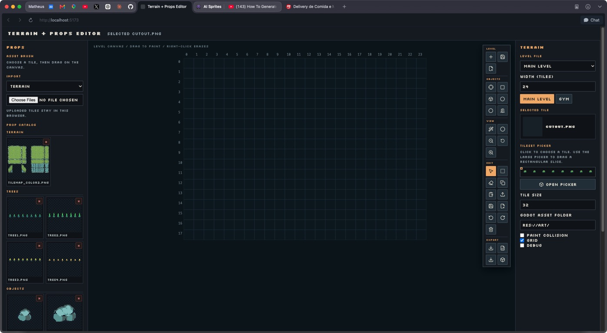

# ▓▓ Pixel Pipeline

> **AI sprites → pixel cleanup → level sketch → Godot export**

Local-first tooling for turning generated 2D game art into usable pixel-art
assets and quick playable level drafts. No hosted backend is required for the
editor.

```text
┌──────────────┐   ┌──────────────┐   ┌──────────────┐
│  IMAGEGEN    │ → │  PIXEL FIX   │ → │  LEVEL GRID  │
│  sprites     │   │  hard edges  │   │  Godot .tscn │
└──────────────┘   └──────────────┘   └──────────────┘
```



## Start

```sh
./run.sh             # Vite editor + local pixel-fixer bridge
./test.sh            # smoke checks
npm run build        # production bundle
```

Open <http://localhost:5173>.

## Pixel-art workflow

1. Generate a single PNG sprite or uniform sprite sheet with `$imagegen`.
   Request hard edges, a fixed frame size, no text or gradients, and a limited
   palette.
2. Upload it to the editor. Uploads automatically use remove.bg through the
   local Python bridge when `REMOVE_BG_API_KEY` is set in `.env`, and fall back
   to the original file if removal fails.
3. Choose **Fix pixel grid** when the result needs the bundled
   [Retro Diffusion Pixel Art Fixer](https://github.com/Retro-Diffusion/pixel-art-fixer)
   locally.
4. Paint tiles, mark collision cells, place objects, and export a PNG preview,
   structured JSON, or `level.tscn`.

Copy exported PNGs into the matching `res://art/` folder before opening the
Godot scene. The editor intentionally exports `Sprite2D`s instead of a
configured Godot `TileSet`, keeping the sketching loop fast.

## Level data

Levels use a structured document with `metadata`, `platforms`, `props`,
`pickups`, `enemies`, and `exits`. See the complete schema and examples in
[`docs/README.md`](docs/README.md) and [`docs/LEVEL_EDITOR.md`](docs/LEVEL_EDITOR.md).

## Project map

```text
src/main.jsx       React/Vite editor
src/styles.css     pixel-art UI styling
server.py          loopback image-processing bridge
assets/            intentional sample/generated art
vendor/            bundled pixel-art fixer
docs/              setup, schema, shortcuts, and export notes
```
