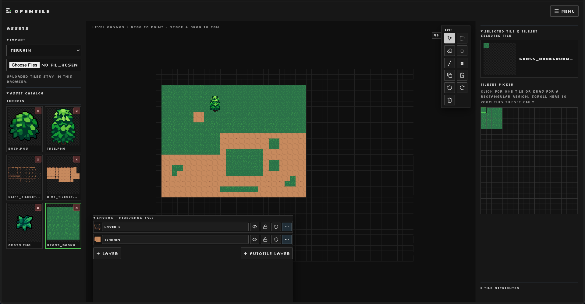

# OpenTile



> **Pixel-art cleanup → tile painting → level sketch → game-ready exports**

OpenTile is a local-first pixel-art level editor for quickly sketching 2D
levels. It keeps assets in IndexedDB and level documents in browser storage;
images are imported directly in the browser.

## Run locally

### Requirements

- Node.js `^20.19.0 || >=22.12.0`

### Install

Clone the repository, install JavaScript dependencies, and start the editor:

```sh
git clone https://github.com/matheuseabra/opentile.git
cd opentile
npm ci
./run.sh
```

Open <http://localhost:5173>.

### Verify

```sh
npm run build
npm test
```

## Pixel-art workflow

1. Prepare a single PNG sprite or uniform sprite sheet. Hard edges, a fixed
   frame size, no text or gradients, and a limited palette work best.
2. Upload it to the editor. The original image is stored in the browser's local
   asset library.
3. Choose a tileset region, then paint tiles, mark collision cells, and place
   objects.
4. Export a PNG preview, structured JSON, or `level.tscn`.

Copy exported PNGs into the matching `res://art/` folder before opening the
Godot scene. The editor intentionally exports `Sprite2D`s instead of a
configured Godot `TileSet`, keeping the sketching loop fast.

## Level data

Levels use a structured document with `metadata`, `platforms`, `props`,
`pickups`, `enemies`, and `exits`. See the complete schema and examples in
[`docs/README.md`](docs/README.md) and [`docs/LEVEL_EDITOR.md`](docs/LEVEL_EDITOR.md).

## Contributing and security

See [CONTRIBUTING.md](CONTRIBUTING.md) for local-development and pull-request
guidance. Report vulnerabilities privately using [SECURITY.md](SECURITY.md).
OpenTile is released under the [MIT License](LICENSE).
